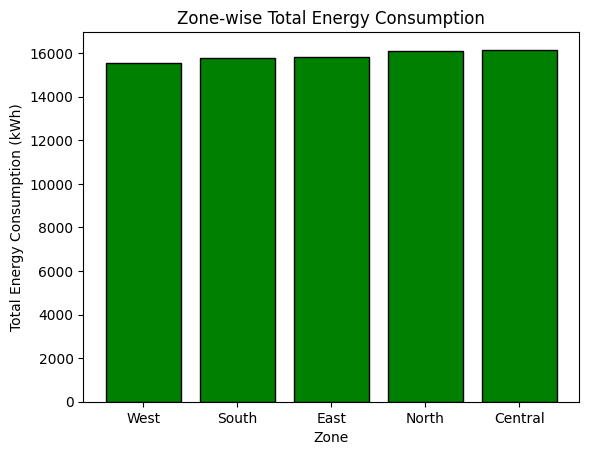
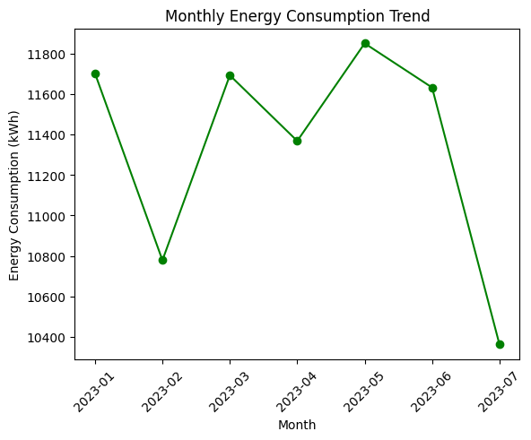

# 🌆 WattWatch  
## Analyzing Urban Energy Consumption for Smarter Cities ⚡

---

## 📌 Project Introduction

Modern cities generate huge amounts of energy consumption data through smart meters installed across residential, commercial, and industrial areas.  
The **WattWatch** project analyzes this data to understand how energy is consumed across different zones of a city and how it impacts cost, reliability, and sustainability.

This project focuses on **urban energy intelligence** and provides **data-driven insights** to help city planners and utility providers make smarter decisions.

---

## 🎯 Project Objectives

The main objectives of this project are:

- To analyze **zone-wise energy consumption**
- To identify **high-demand and inefficient zones**
- To study **time-based energy usage trends**
- To assess **energy costs and tariff impact**
- To evaluate **meter reliability and power outages**
- To suggest **smart city energy improvements**

---

## 📂 Dataset Overview

**Dataset Name:** SmartCityEnergy.csv  

The dataset contains smart meter readings collected across different zones of a city.

### Key Attributes Explained

| Attribute | Description |
|--------|------------|
| Zone | City zones such as North, South, East, West, Central |
| Date | Date and time of energy reading |
| MeterID | Unique identifier for each smart meter |
| ConsumerType | Residential, Commercial, Industrial |
| EnergyConsumed_kWh | Total energy consumed |
| PeakUsage_kWh | Maximum energy used during peak hours |
| TariffRate | Cost per unit of electricity |
| MeterStatus | Indicates whether the meter is active or faulty |
| OutageMinutes | Duration of power outages |

---

## 🛠️ Tools & Technologies Used

- **MySQL** – for structured data analysis and querying  
- **Python** – for data processing and visualization  
- **Pandas** – for data manipulation  
- **Matplotlib** – for charts and trends  

---

## 🔹 Analytical Scope

### 1️⃣ Zone-wise Energy Consumption Analysis

This analysis identifies how energy usage varies across different city zones.  
It helps determine:

- Which zones consume the most energy  
- Where infrastructure upgrades are needed  
- How population and commercial activity affect energy demand  

---

### 2️⃣ Consumer Type Analysis

Energy usage is analyzed based on consumer categories:

- Residential  
- Commercial  
- Industrial  

This helps understand which consumer group contributes the most to overall consumption and revenue.

---

### 3️⃣ Monthly & Seasonal Trend Analysis

Energy consumption is analyzed on a monthly basis to identify:

- Seasonal usage patterns  
- Peak demand periods  
- Summer vs non-summer energy behavior  

---

### 4️⃣ Cost & Tariff Impact Analysis

This section evaluates how tariff rates influence:

- Total energy cost per zone  
- Revenue generation  
- Cost burden across consumers  

---

### 5️⃣ Reliability & Outage Analysis

This analysis focuses on:

- Faulty meters  
- Frequency of power outages  
- Average outage duration per zone  

It helps identify zones with poor infrastructure reliability.

---

## 📊 Visual Analysis

### 🔹 Zone-wise Total Energy Consumption

**Insight:**  
Central and high-density zones show significantly higher energy usage compared to others.

---

### 🔹 Monthly Energy Consumption Trend

**Insight:**  
Energy demand increases during summer months, indicating higher cooling and industrial usage.

---

## 📈 Key Findings

- The **Central zone** consumes the highest energy  
- **Residential consumers** contribute the most overall usage  
- **Industrial consumers** show low energy efficiency  
- Energy demand peaks during **summer months**  
- Zones with higher consumption experience **more outages**  

---

## 💡 Business Insights

- High-demand zones require **grid strengthening**
- Peak-hour usage puts pressure on infrastructure
- Faulty meters increase outage risk and revenue loss
- Energy efficiency varies significantly by consumer type

---

## 🚀 Recommendations for Smart Cities

- Implement **smart grid technology** in high-load zones  
- Introduce **time-based tariffs** to reduce peak demand  
- Improve **preventive maintenance** of meters  
- Promote **renewable energy integration**  
- Enable **real-time monitoring dashboards**  

---

## 🌱 Impact & Value

This project demonstrates how data analytics can:

- Improve energy efficiency  
- Reduce outages  
- Support sustainable urban development  
- Enable informed decision-making for smart cities  

---

## 🏁 Conclusion

**WattWatch** successfully converts raw smart meter data into meaningful insights that can help cities become more energy-efficient, reliable, and sustainable.

This project showcases strong skills in:
- Data analysis  
- Business thinking  
- Visualization  
- Smart city problem-solving  

---

## 👩‍🎓 Author

**Disha Lukhi**  
Data Analytics | Smart City Energy Analysis  

---

